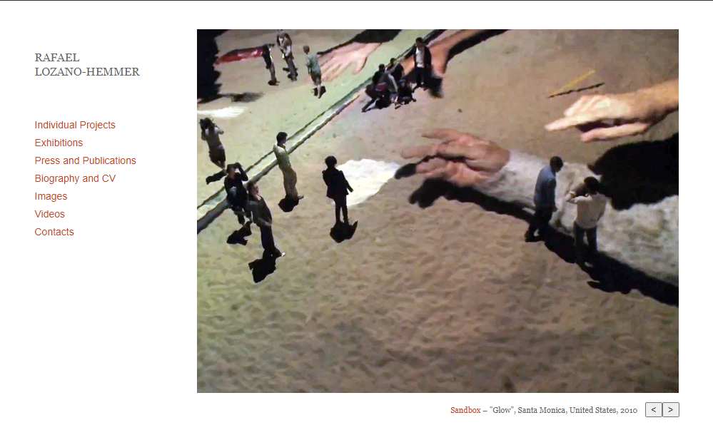

# Conférence Antimodular

## Voici Antimodular

les expositions sont une chose merveilleuse. Ils permettent aux personnes qui ont eu des idées étonnantes et ont transformé leurs idées en quelque chose de tangible de les partager avec le reste du monde. Mais comment se font ces expositions ? C'est ce que Jade Séguela, registraire du Studio Antimodular dirigé par l'artiste Rafael Lozano-Hemmer, est venue ici expliquer.

## Les aspects d'une exposition.
Les points abordés par Jade Séguela lors de la conférence comprenaient la façon dont Rafael Lozano-Hemmer estime que sans public, une exposition interactive ne peut exister puisqu'il n'y a personne pour interagir avec elle, donc ce sont les gens qui font que les expositions atteignent leur plein potentiel. Elle a également pris le temps de nous expliquer pourquoi documenter une exposition avant de l'envoyer est très important, car cela permet de s'assurer que rien ne manque, que tout fonctionne comme il se doit, facilite le montage, etc. En gros, si tout n'est pas bien documenté, cela pose beaucoup de problèmes.

## Mes appréciations
En tout, je suis vraiment content d'avoir assisté à cette conférence car je ne suis pas très informé en matière de processus de création d'expositions, donc c'était bien d'avoir un expert pour m'expliquer ainsi qu'à tout le monde.

## Références
https://antimodular.com/
