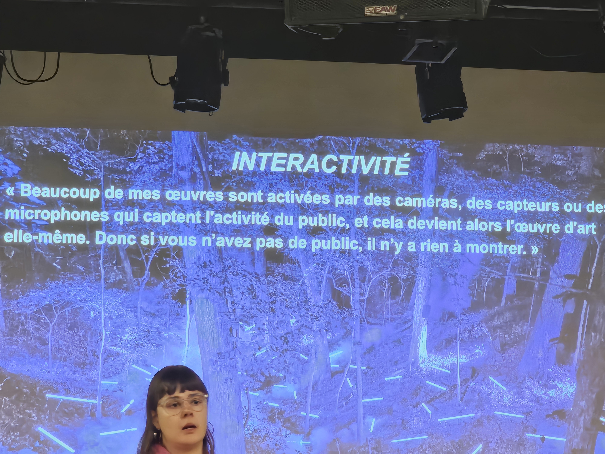
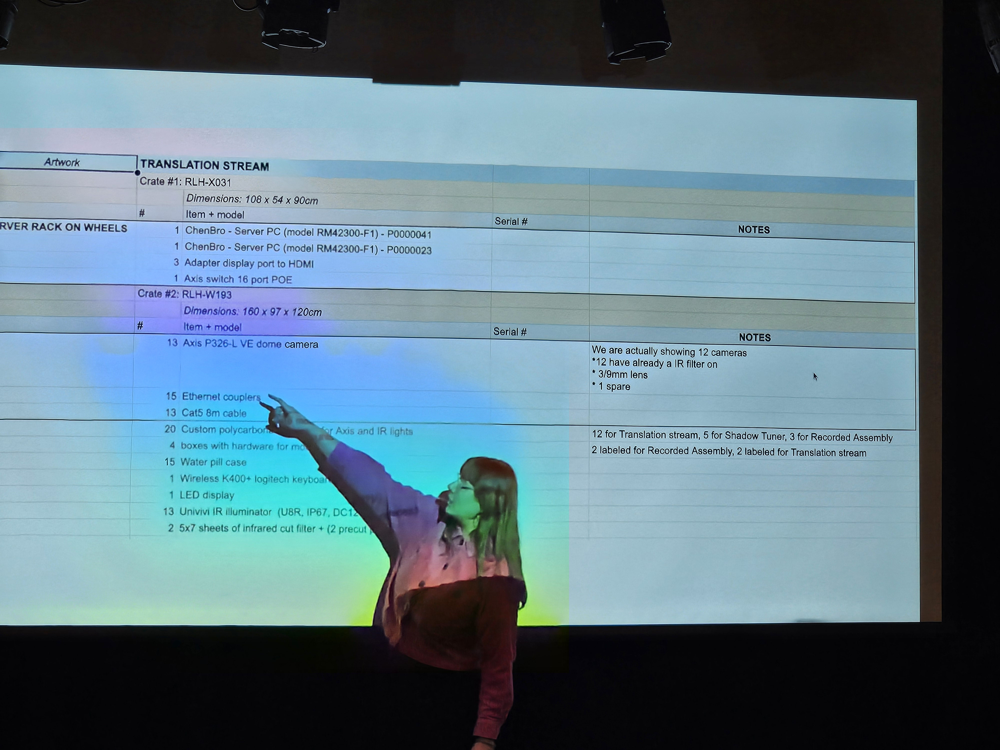

# Conférence Antimodular

## Voici Antimodular

Les expositions sont une chose merveilleuse. Elles permettent aux personnes qui ont eu des idées étonnantes et qui les ont transformées en quelque chose de tangible de les partager avec le reste du monde. Mais comment se déroulent ces expositions ? C'est ce que Jade Séguela, registraire du Studio Antimodular dirigé par l'artiste Rafael Lozano-Hemmer, est venue ici pour nous expliquer.

## Les aspects d'une exposition.
Les points abordés par Jade Séguela lors de la conférence comprenaient la façon dont Rafael Lozano-Hemmer estime que sans public, une exposition interactive ne peut exister, puisqu'il n'y a personne pour interagir avec elle. Ainsi, ce sont les gens qui permettent aux expositions d'atteindre leur plein potentiel. Elle a également pris le temps de nous expliquer l'importance de documenter une exposition avant son envoi, afin de garantir l'intégralité du contenu, le bon fonctionnement de tout, et de faciliter le montage, entre autres. En résumé, un mauvais document peut poser de nombreux problèmes.

## Mes appréciations
En tout cas, je suis vraiment content d'avoir assisté à cette conférence car je ne suis pas très informé sur le processus de création d'expositions. Donc, c'était bien d'avoir un expert pour m'expliquer, ainsi qu'à tout le monde, et j'espère pouvoir visiter un jour une de leurs expositions. 

## Références
https://antimodular.com/
