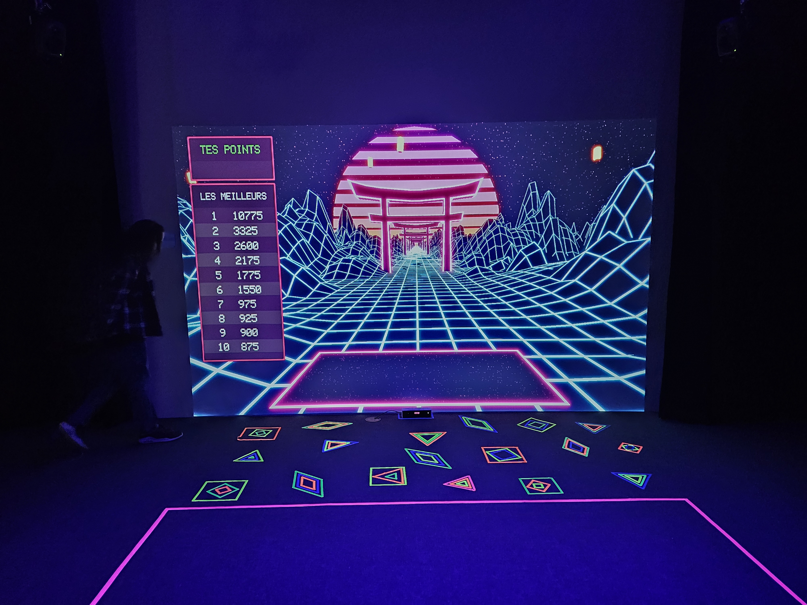
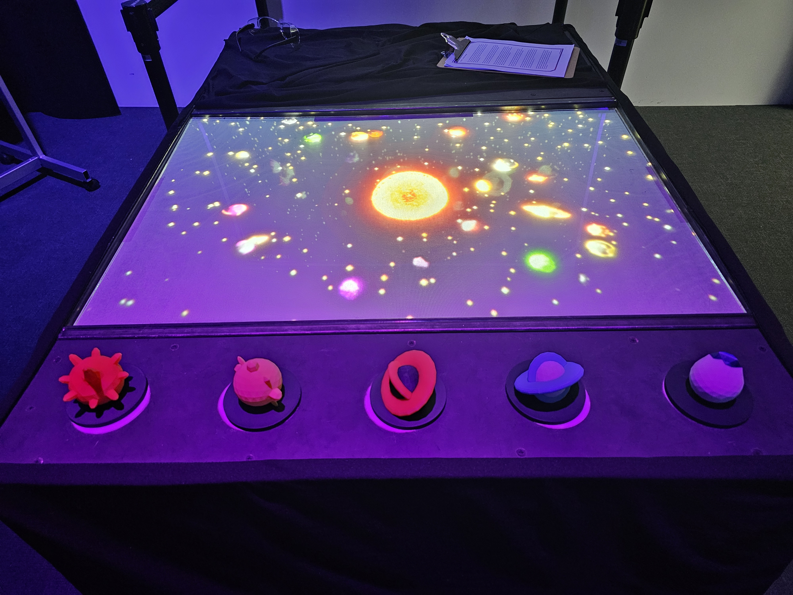
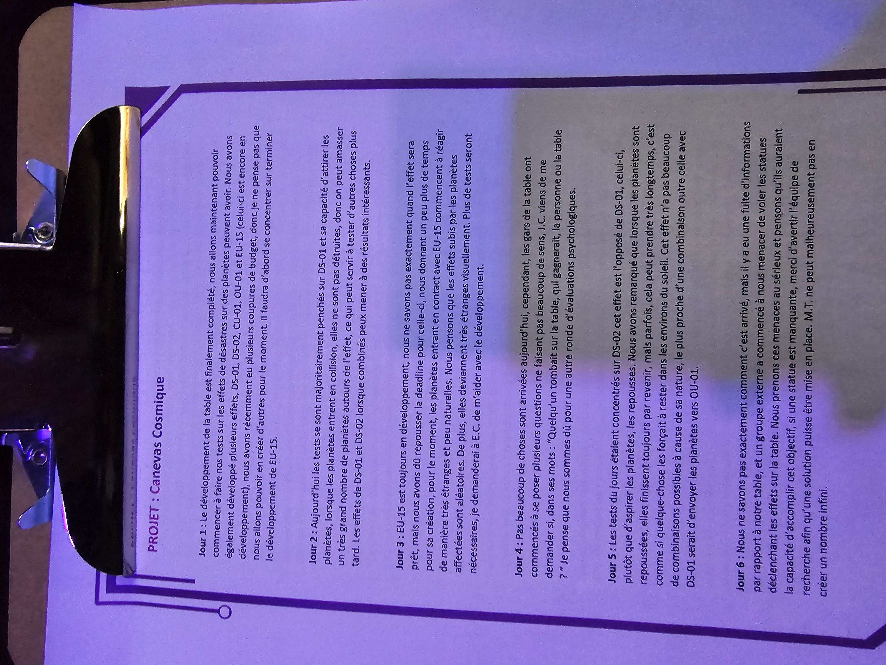
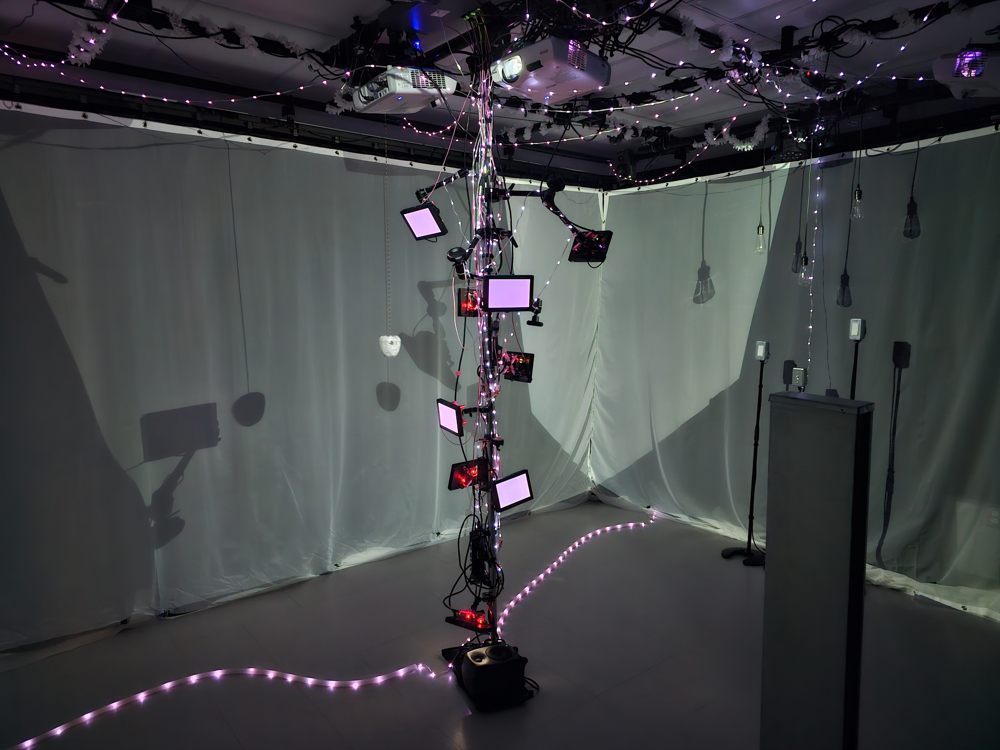

# Crescentia

## 1. Kigo

### Créateurs: Érick Ouellette, William Rathier Mailly, Gabriel Clerval, Nicolas St-Martin, Antoine Dion
L'installation Kigo se base principalement sur les saisons et comment ils se changent constament. Ceci est une bonne exemple d'évolution environnementale.

### Schéma: 

### Cours importants: 

## 2. Canevas Cosmique

### Créateurs: Jacob Alarie-Brousseau, Étienne Charron, Jérémy Cholette, Quoc Huy Do, Mikaël Tourangeau
L'installation Canevas Cosmique à pour but de démontrer les différents phénomènes astronomiques, une autre exemple d'évolution environnementale.

### Schéma: 

### Cours importants: 

## 3. Rhizomatique

### Créatrices: Jolyanne Desjardins, Maïka Désy, Laurie Houde, Felix Testa Radovanovic
L'installation Rhizomatique nous montre le lien entre le temps et les souvenirs et comment le précédent affect ceci. Le lien entre Rhizomatique et l'évolution psychologique est bien évident.

### Schéma: 

### Cours importants: 

## 4. Sonalux

### Créateurs: Antoine Haddad, Camélie Laprise, Ghita Alaoui, Vincent Desjardins
L'installation Sonalux nous poussent au-dessus de les limites du réel et nous apportent dans une monde sans contraintes pour nous donner le contrôle totale. Je dirai que ceci est une exemple d'évolution humaine.

### Schéma: 
 

### Cours importants: 

## 5. Effet-Papillon

### Créateurs: Raphaël Dumont, Alexis Bolduc, William Morel, Alexia (Ryan) Papanikolaou, Viktor Zhuravlev, Jasmine Lapierre
L'installation Effet-Papillon nous montre le cycle de vie d'un pommier et comment l'effet-papillon de nos choix peut affecter le pommier.  L'évolution organique et les conséquences de nos gestes sont mises en evidence.

### Schéma: 

### Cours importants: 

## Références

[Crescentia](https://tim-montmorency.com/2024/), [Grille de cours multimédia](https://www.cmontmorency.qc.ca/programmes/nos-programmes-detudes/techniques/techniques-dintegration-multimedia/grille-de-cours/)
