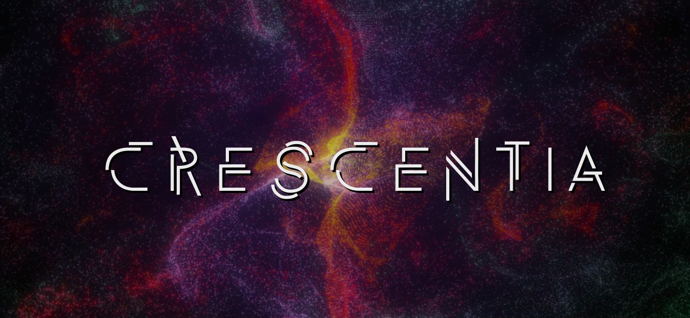

# Crescentia

## 1. Kigo

### Créateurs: Érick Ouellette, William Rathier Mailly, Gabriel Clerval, Nicolas St-Martin, Antoine Dion

### Schéma: 

### Cours importants: 

## 2. Canevas Cosmique

### Créateurs: Jacob Alarie-Brousseau, Étienne Charron, Jérémy Cholette, Quoc Huy Do, Mikaël Tourangeau

### Schéma: 

### Cours importants: 

## 3. Rhizomatique

### Créatrices: Jolyanne Desjardins, Maïka Désy, Laurie Houde, Felix Testa Radovanovic

### Schéma: 

### Cours importants: 

## 4. Sonalux

### Créateurs: Antoine Haddad, Camélie Laprise, Ghita Alaoui, Vincent Desjardins

### Schéma: 

### Cours importants: 

## 5. Effet-Papillon

### Créateurs: Raphaël Dumont, Alexis Bolduc, William Morel, Alexia (Ryan) Papanikolaou, Viktor Zhuravlev, Jasmine Lapierre

### Schéma: 

### Cours importants: 

## Références

[Crescentia](https://tim-montmorency.com/2024/), [Grille de cours multimédia](https://www.cmontmorency.qc.ca/programmes/nos-programmes-detudes/techniques/techniques-dintegration-multimedia/grille-de-cours/)
