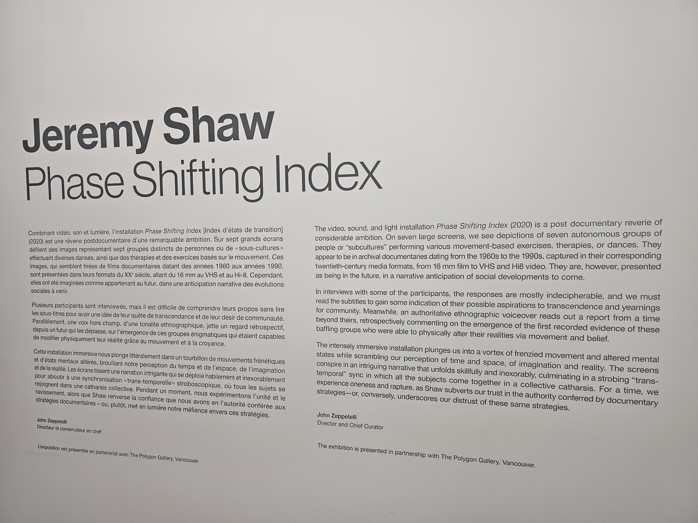

# TP1
## Exposition Jeremy Shaw

## Phase Shifting Index

## Fonderie Darling

## Exposition temporaire et intérieure
## Le 31 Janvier, 2024
## Phase Shifting Index

## Jeremy Shaw
## 2020
## Description de l'oeuvre
Vaste installation vidéo immersive à sept canaux, Phase Shifting Index [Index d’états de transition] est une rêverie parascientifique exaltante d’une grande ambition intellectuelle et artistique, et le point culminant des travaux récents de Shaw. Dans ce qui semble être une étude anthropologique d’un futur lointain, une narration commente de manière rétrospective l’émergence de nouvelles réalités déconcertantes sur sept écrans affichant ce qui s’avère être des images d’archives de divers groupes de thérapie par le mouvement des années 60 aux années 90. Ces images sont captées dans les formats de l’époque – allant du film 16 mm au VHS en passant par le Hi-8. (https://fonderiedarling.org/Phase-Shifting-Index)

## Installation immersive

## Mise en espace
7 écrans sont suspendues dans la salle avec des câbles, accompagnés par des projecteurs, des haut-parleurs et des lumières DEL dans le but de bien transmettre l'idée de chaque vidéos et d'améliorer l'expérience des visiteurs. Des bancs sont aussi présents pour les visiteurs. 

## Composantes et techniques
Installation immersive, écran, 16mm VHS, Hi-8.

## Éléments nécessaires à la mise en exposition
bancs, haut-parleurs, câbles, cartel, projecteurs, lumières DEL.

## Expérience vécue
Il-y-a rien à vraiment faire, il faut juste observer les installations . À mon avis, les installations étaient amusant, mais j'étais confus pour la plupart du temps pendant l'expo.

## Ce qui m'a plu
J'ai bien aimé quand les acteurs dans chaque installations ont commencés à faire les mêmes gestes.
## Ce que je ferait autrement
J'aurait bien séparés chaque installation dans chaque coins du salle, éloignés des autres, car plusieurs fois, l'audio des installations se mélangaient.

## Références
https://fonderiedarling.org/Vernissage-de-Phase-Shifting-Index

https://theshipyardsdistrict.ca/event/jeremy-shaw-phase-shifting-index

https://thepolygon.ca/exhibition/jeremy-shaw-phase-shifting-index/

https://fonderiedarling.org/Phase-Shifting-Index
